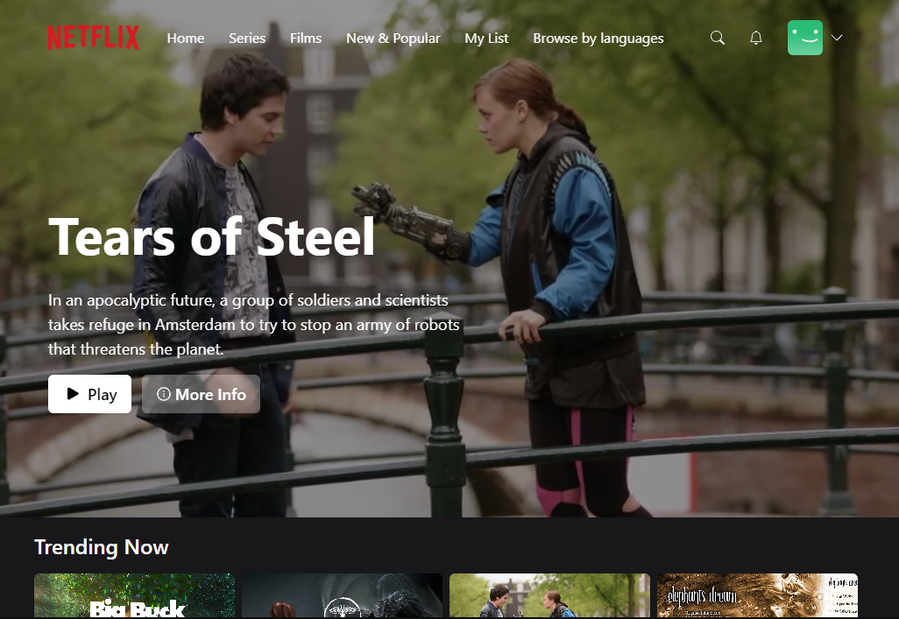

This is a Full Stack Netflix clone done using React(NextJs), Tailwind CSS, Prisma and MongoDB.

Main Features

1.Homepage (pages/index.tsx):

The homepage displays a billboard of a featured movie or show, followed by a list of trending movies and the user's favorite movies.
It uses various hooks like useMovieList to fetch the list of movies and useFavorites to fetch the user's favorite movies.
An InfoModal component is used to display detailed information about a selected movie.
If a user is not authenticated, they are redirected to the authentication page.

2.Authentication (pages/auth.tsx):

This page provides both login and signup functionalities.
Users can either sign in using their email and password or use third-party authentication providers like Google and GitHub.
The page toggles between login and signup views based on the user's choice.
Axios is used to make API requests for the signup process.

3.Billboard Hook (hooks/useBillboard.ts):

This custom hook fetches a random movie or show to be displayed as the billboard on the homepage.
It uses the SWR library for data fetching and caching.

4.Current User Hook (hooks/useCurrentUser.ts):

This hook fetches the current authenticated user's data.
Like the billboard hook, it also uses the SWR library.

5.Prisma Database Client (lib/prismadb.ts):

This file sets up the Prisma client for database interactions.
Prisma is an open-source database toolkit that provides a type-safe and auto-generated query builder for TypeScript and Node.js.

